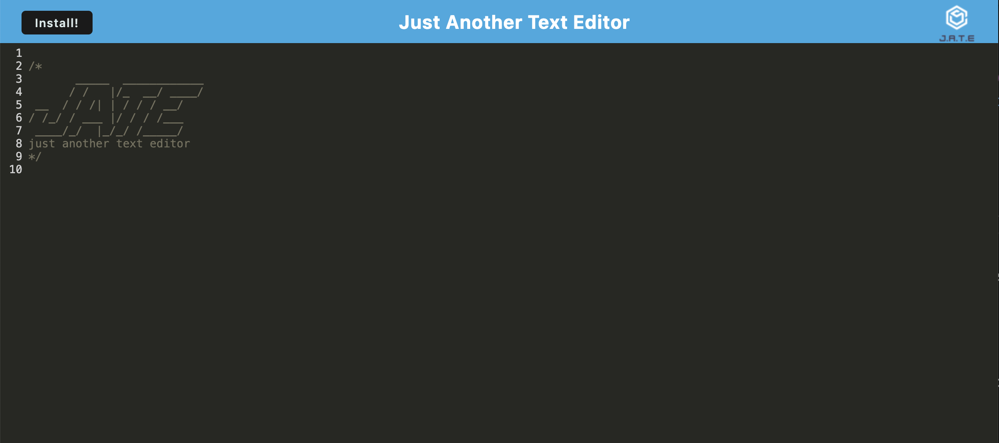
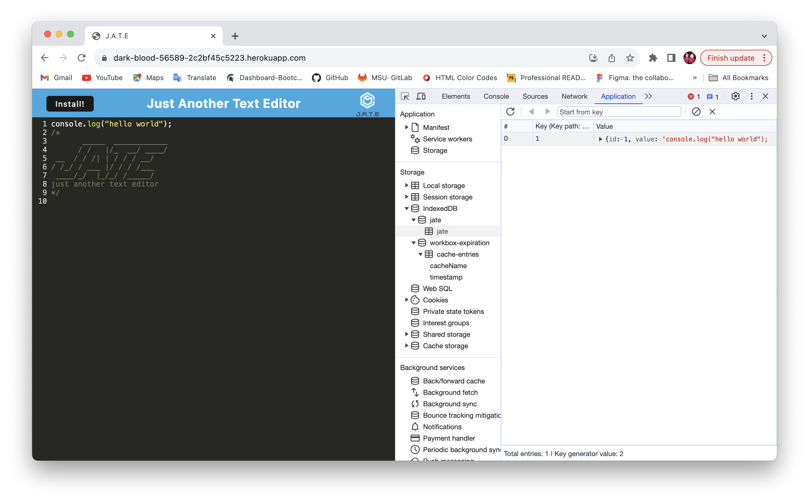
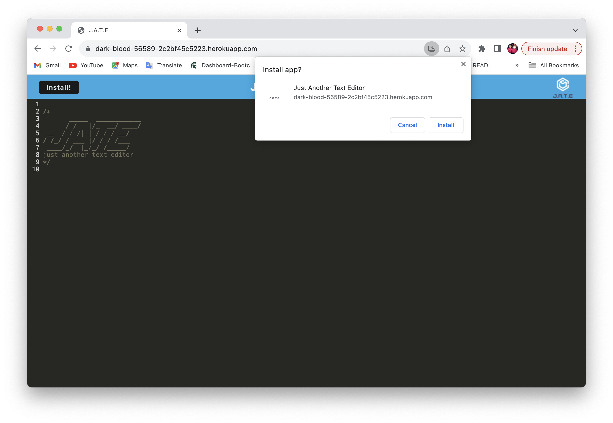
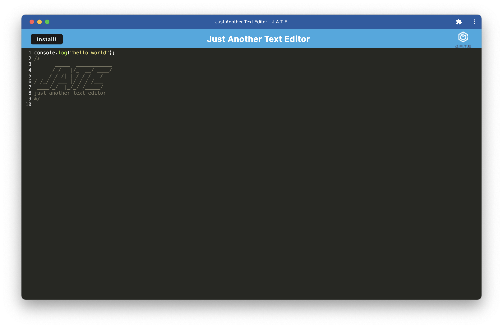

# Jate Text Editor

## Description

This app is a text editor using Progressive Web Applications (PWA) that allows us to create a single-page application that can be supported by any browser. It is a text editor that can be used offline and installed to your desktop. 

## Installation

When you go to the applications url, on the navbar there will be a button that says Install. You can click on the button and a prompt will pop-up asking if you want to install the app.

## Usage

You can have access to the text editor application through the following url: https://dark-blood-56589-2c2bf45c5223.herokuapp.com/. The PWA text editor generates an HTML file, a service worker and a manifest file. Once you enter content in the text editor and your cursor looses focus from the DOM window then immediately the content is saved into the IndexDB. You can install the app by clicking on the Install button and install from the prompt that pops up. The app will download to your desktop. The following screenshots will demonstrate a bit of the PWA.

How the app looks in the browser:

Content saved into the IndexDB:

This is how to install the app:

How the app looks already installed to computer:

## Credits

N/A

## License

More details on the MIT License can be found in the repo.
